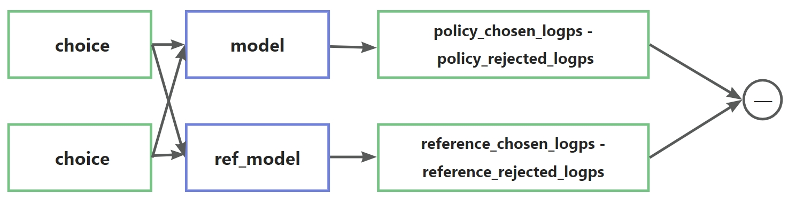

# 直接偏好优化(Direct Preference Optimization,DPO)
论文链接：[Direct Preference Optimization: Your Language Model is Secretly a Reward Model](https://arxiv.org/abs/2305.18290)
## 1. idea
<p style="color:red; font-weight:bold; text-align:center;">是否可以绕过奖励模型和强化学习，直接从偏好对出发训练策略？</p>

关键思路是利用从奖励函数到最优策略的解析映射，这使我们能够将基于奖励函数的损失函数转换为基于策略的损失函数。这种变量变换方法避免了拟合一个显式的独立奖励模型，同时仍能在现有的人类偏好模型（如BT模型）下进行优化

> 就是想把reward model去掉，将偏好融入损失里面
DPO无需显式地构建一个奖励模型，而是通过训练语言模型使其最大化符合人类偏好的策略（把对偏好对的建模融入到策略里面）

---

## 1. 推导过程  
DPO（直接偏好优化）算法的推导过程主要围绕从强化学习目标出发，通过一系列变换得到最优策略及目标函数，以下是大致推导过程总结：  

1. **确定强化学习目标**：从与先前研究相同的强化学习目标出发，在一般奖励函数 $r^{-}$ 下，对受KL散度约束的奖励最大化目标进行优化，**目标函数**为：  

   $$\max_{\pi} \mathbb{E}_{x \sim \mathcal{D}, y \sim \pi}[r(x, y)] - \beta \mathbb{D}_{KL}[\pi(y | x) || \pi_{ref}(y | x)]$$  

   其中 $\pi$ 为策略，$\mathcal{D}$ 为数据分布，$r(x, y)$ 为奖励函数，$\beta$ 为参数，$\pi_{ref}(y | x)$ 为参考策略。  

2. **推导最优策略形式**：借鉴先前研究[···]，可以得出上述目标的最优解形式为  

   $$\pi_{r}(y | x) = \frac{1}{Z(x)} \pi_{ref}(y | x) \exp \left( \frac{1}{\beta} r(x, y) \right)$$  

   其中 $Z(x) = \sum_{y} \pi_{ref}(y | x) \exp \left( \frac{1}{\beta} r(x, y) \right)$ 是配分函数。完整推导见附录A.1。  

3. **分析配分函数问题**：即便使用真实奖励函数 $r^{*}$ 的最大似然估计 $r_{\phi}$，估计配分函数 $Z(x)$ 的计算成本仍然很高，使得这种表示形式在实际中难以应用。  

4. **重新表示奖励函数**：对最优策略公式两边取对数并进行代数运算，将奖励函数 $r(x, y)$ 表示为  

   $$r(x, y) = \beta \log \frac{\pi_{r}(y | x)}{\pi_{ref}(y | x)} + \beta \log Z(x)$$  

   用最优策略 $\pi_{r}$、参考策略 $\pi_{ref}$ 以及配分函数 $Z(\cdot)$ 来表达。  

5. **奖励函数带入到BT模型中（或Plackett-Luc模型）**：  

   Bradley-Terry模型：  

   $$p^{*}(y_1 \succ y_2|x) = \frac{\exp(r^{*}(x, y_1))}{\exp(r^{*}(x, y_1)) + \exp(r^{*}(x, y_2))}$$  

   将 $r(x, y)$ 代入BT模型得到：  

   $$
   \begin{align*}
   p^{*}(y_1 \succ y_2|x) &= \frac{\exp\left( \beta \log \frac{\pi^{*}(y_1|x)}{\pi_{\text{ref}}(y_1|x)} + \beta \log Z(x) \right)}{\exp\left( \beta \log \frac{\pi^{*}(y_1|x)}{\pi_{\text{ref}}(y_1|x)} + \beta \log Z(x) \right) + \exp\left( \beta \log \frac{\pi^{*}(y_2|x)}{\pi_{\text{ref}}(y_2|x)} + \beta \log Z(x) \right)} \\
   &= \frac{1}{1 + \exp\left( \beta \log \frac{\pi^{*}(y_2|x)}{\pi_{\text{ref}}(y_2|x)} - \beta \log \frac{\pi^{*}(y_1|x)}{\pi_{\text{ref}}(y_1|x)} \right)} \\
   &= \sigma\left( \beta \log \frac{\pi^{*}(y_1|x)}{\pi_{\text{ref}}(y_1|x)} - \beta \log \frac{\pi^{*}(y_2|x)}{\pi_{\text{ref}}(y_2|x)} \right).
   \end{align*}
   $$  

   最终的DPO算法loss为：  

   $$
   \mathcal{L}_{\text{DPO}}(\pi_{\theta} ; \pi_{\text{ref}}) = - \mathbb{E}_{(x, y_w, y_l) \sim \mathcal{D}} \left[ \log \sigma \left( \beta \log \frac{\pi_{\theta}(y_w | x)}{\pi_{\text{ref}}(y_w | x)} - \beta \log \frac{\pi_{\theta}(y_l | x)}{\pi_{\text{ref}}(y_l | x)} \right) \right]
   $$

---

## 输入数据格式
> 数据路径：data/dpo_data.jsonl

```json
数据是偏好对或者多个排序回答。本例子使用偏好对。
{"chose":"prompt+chose", "rejected":"prompt+rejected"}
{"chose":"prompt+chose", "rejected":"prompt+rejected"}
......
```

## 损失loss代码
<p style="text-align: center;">
  
</p>

1. 构造数据集，通过对同一问题的两种回复的倾向性：chosen or rejected，反映人类偏好。
2. 优化，具体过程大概是，对于同一个question prompt，模型在两种模型：policy model 和 reference model下分别生成，对应chosen 和 rejected label真值标签的生成概率，因此可以获得四种概率值：policy_chosen_logps, policy_rejected_logps, reference_chosen_logps, reference_rejected_logps, 用于DPO loss计算。
3. 对数概率相减
    - policy_chosen_logps减去policy_rejected_logps。
    - reference_chosen_logps - reference_rejected_logps
    - 两差值相减，得到DPO loss

```python
def dpo_loss(
        self,
        policy_chosen_logps: torch.FloatTensor,
        policy_rejected_logps: torch.FloatTensor,
        reference_chosen_logps: torch.FloatTensor,
        reference_rejected_logps: torch.FloatTensor,
    ) -> Tuple[torch.FloatTensor, torch.FloatTensor, torch.FloatTensor]:
        """Compute the DPO loss for a batch of policy and reference model log probabilities.

        Args:
            概率对数之和(一个数)
            policy_chosen_logps: Log probabilities of the policy model for the chosen responses. Shape: (batch_size,)
            policy_rejected_logps: Log probabilities of the policy model for the rejected responses. Shape: (batch_size,)
            reference_chosen_logps: Log probabilities of the reference model for the chosen responses. Shape: (batch_size,)
            reference_rejected_logps: Log probabilities of the reference model for the rejected responses. Shape: (batch_size,)

        Returns:
            A tuple of three tensors: (losses, chosen_rewards, rejected_rewards).
            The losses tensor contains the DPO loss for each example in the batch.
            The chosen_rewards and rejected_rewards tensors contain the rewards for the chosen and rejected responses, respectively.
        """
        pi_logratios = policy_chosen_logps - policy_rejected_logps
        if self.reference_free:
            ref_logratios = torch.tensor([0], dtype=pi_logratios.dtype, device=pi_logratios.device)
        else:
            ref_logratios = reference_chosen_logps - reference_rejected_logps

        logits = pi_logratios - ref_logratios

        # The beta is a temperature parameter for the DPO loss, typically something in the range of 0.1 to 0.5.
        # We ignore the reference model as beta -> 0. The label_smoothing parameter encodes our uncertainty about the labels and
        # calculates a conservative DPO loss.
        # self.label_smoothing一个DPO的一个变种，label_smoothing为0则是原始的DPO代码。
        if self.loss_type == "sigmoid":
            losses = (
                -F.logsigmoid(self.beta * logits) * (1 - self.label_smoothing)
                - F.logsigmoid(-self.beta * logits) * self.label_smoothing
            )
        ......
        return losses, chosen_rewards, rejected_rewards
```

```python
# 计算每个模型的Log probabilities
def compute_logprobs(logits, labels, mask=None):
    """
    logits:  shape (batch_size, sequence_len, vocab_size)，即将label输入给模型后输出的结果
    labels:  shape (batch_size, sequence_len)

    return： (batch_size, ) 概率对数之和
    """

    # 需要先进行位移操作
    # 去掉标签的第一个
    labels = labels[:, 1:].clone()
    # 去掉模型输出的最后一个
    logits = logits[:, :-1, :]
    logps = F.log_softmax(logits, dim=-1)
    select_logprobs = torch.gather(
        input=logps,
        dim=-1,
        index=labels.unsqueeze(1)
    ).squeeze(1)

    if mask is not None:
        mask = mask[:, 1:].clone()
        # 进行掩码padding部分
        select_logprobs = select_logprobs * mask
        # 计算每一句的平均
        average_logprobs = select_logprobs.sum(-1) / mask.sum(-1)
        return average_logprobs
    else:
        return select_logprobs.mean(-1)
```