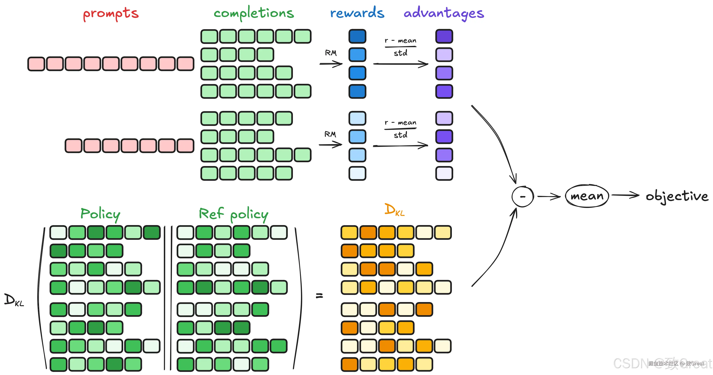
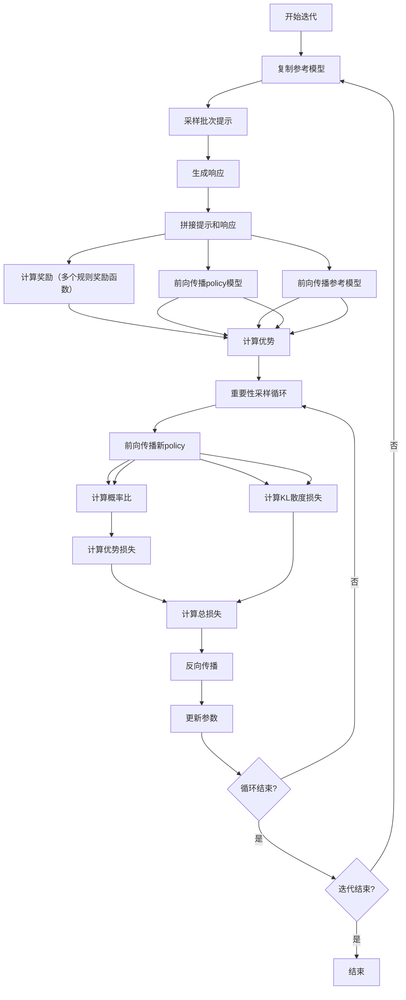
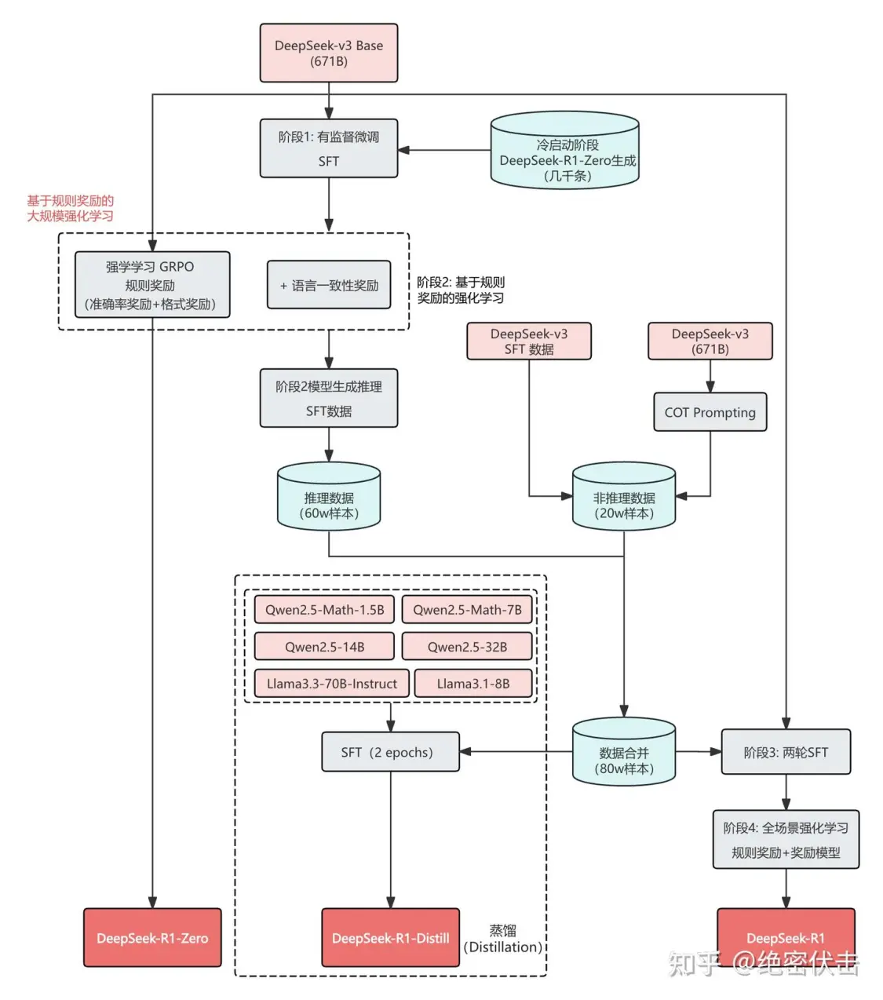

# GRPO,Group Relative Policy Optimization
## 与PPO的核心区别(优势计算方式不同)
在PPO中，优势 $A_t$ 通常是通过广义优势估计（GAE）来计算的，它基于单个输出的值函数。而在GRPO中，优势的计算基于组奖励 $\hat{A}_{i,t}$，即：

$$\hat{A}_{i,t} = \frac{r_i - \text{mean}(r)}{\text{std}(r)}$$

其中：
- $r_i$ 是针对每个样本输出 $o_i$ 计算的奖励。
- $\text{mean}(r)$ 是该组的平均奖励。
- $\text{std}(r)$ 是该组的标准差。

## token奖励r

组级别的奖励作为组内每一步动作(生成next word)的奖励值。

$$\tilde{r}_i^{\text{index}(j)} = \frac{r_i - \text{mean}(R)}{\text{std}(R)}$$

其中：
- $r_i$ 是针对每个样本输出 $o_i$ 计算的奖励。
- $\text{mean}(R)$ 是所有组的平均奖励。

## token优势Advantage

GRPO的优势计算方式有两种：

1. 过程监督下，将每个标记的优势计算为后续步骤归一化奖励的总和

$$\hat{A}_{i,t} = \sum_{\text{index}(j) \geq t} \tilde{r}_i^{\text{index}(j)}$$

PPO的reward模型的值只是根据最后一个token上算出来的，根据最后一个token算出来reward值。不是算每个token的奖励值。
GRPO的贡献：提出了一个不需要训练状态价值网络，就可以估算每个token优势值的方法。相当于给每个token赋予一个奖励值r，只不过是从batch中每条数据的（reward值-平均值）/标准差。优势Advantage是后续token奖励值总和。

2. 结果监督下，每个输出的所有 token 的优势都是归一化后的最终奖励

$$\hat{A}_{i,t} = \tilde{r}_i = \frac{r_i - \text{mean}(r)}{\text{std}(r)}$$

# GRPO过程

<p style="text-align: center;">
  
  <figcaption style="text-align: center;">GRPO过程</figcaption>
</p>

**伪代码：**

```python
for _ in range(num_iterations):
    reference_model = copy.deepcopy(policy_model)
    for _ in range(steps_per_iteration):
        # 遍历提示数据集的每个批次
        # 每个批次的prompt重复num_generations次，生成num_generations个响应
        batch_prompt = random.sample(prompts, batch_size)
        batch_prompt = batch_prompt.repeat_interleave(num_generations)
        # 使用当前policy模型根据批次提示生成响应
        batch_response = actor_model.generate(batch_prompt)
        # 将批次提示和生成的响应拼接在一起
        batch_data = concat(batch_prompt, batch_response)

        # 奖励模型有多个，每个奖励模型对数据进行打分，得到多个奖励，最后相加得到最终奖励
        batch_rewards = reward_model(batch_data)

        # 前向传播当前policy模型，得到所有可能动作/词元的完整概率分布、实际生成序列的动作/词元的具体概率
        old_actor_all_probs, old_actor_probs = actor_model.forward(batch_data)
        # 前向传播参考模型，得到所有可能动作/词元的完整概率分布、实际生成序列的动作/词元的具体概率
        ref_all_probs, ref_probs = ref_model.forward(batch_data)
        # 优势计算有两种方式：过程监督和结果监督
        # 过程监督：将每个标记的优势计算为后续步骤归一化奖励的总和
        # 结果监督：每个输出的所有 token 的优势都是归一化后的最终奖励
        advantages = compute_advantages(batch_rewards)

        # 重要性采样
        for _ in range(mu):
            # 前向传播当前活动模型，得到所有可能动作/词元的完整概率分布、实际生成序列的动作/词元的具体概率和所有值
            # actor_all_probs：actor模型对所有可能动作/词元的完整概率分布（logits或log probabilities）
            # actor_probs：actor模型对实际生成序列的动作/词元的具体概率（即生成轨迹的概率）
            new_actor_all_probs, new_actor_probs = actor_model.forward(batch_data)

            # 计算新、旧policy概率比
            ratio = new_actor_probs / old_actor_probs
            
            # 计算优势损失
            loss_adv = torch.mean(-advantages * ratio)

            # 计算当前活动模型和参考模型之间的KL散度损失
            # per_token_kl = torch.exp(ref_all_probs - new_actor_all_probs) - (ref_all_probs - new_actor_all_probs) - 1
            loss_kl = compute_KL(new_actor_all_probs, ref_all_probs)

            # 计算总损失，由actor损失和critic损失加权求和得到
            loss = loss_adv + self.beta * loss_kl

            loss.backward()
            optimizer.step()
            optimizer.zero_grad()
```

# GRPO流程图


---
# <center>DeepSeek-R1</center>
## 1. deepseek-R1-Zero
纯强化学习(GRPO)

**<span style="color:red;">缺点</span>**：<span style="color:red;">中英文混乱、格式混乱</span>

## 2. deepseek-R1训练流程
引用：[DeepSeek-R1 技术报告解读](https://zhuanlan.zhihu.com/p/19868935152)

| 模型 | 方法 |
| --- | --- |
| DeepSeek-R1-Zero | 纯强化学习 |
| DeepSeek-R1 | 冷启动 SFT -> RL -> COT + 通用数据 SFT（80w）->全场景 RL |
| 蒸馏小模型 | 直接用上面的 80w 数据进行SFT |

**第一个RL(GRPO):** 针对推理任务（数学、代码等）的强化学习。根据有固定答案的任务设计奖励函数。

**第二个RL(常规RL):** 常规的强化学习。融入人类偏好奖励模型

- 语言一致性：目标语言的占比

<p style="text-align: center;">
  
  <figcaption style="text-align: center;">deepseek-R1训练流程</figcaption>
</p>

