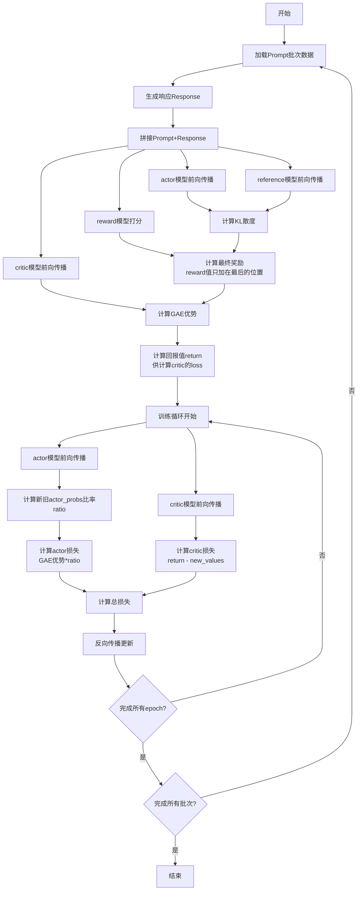

# PPO
## 1. 简介
近端策略优化（Proximal Policy Optimization,PPO）是一种基于策略梯度的强化学习算法，用于训练策略网络以最大化预期回报。
PPO是一种基于策略梯度的优化方法，其核心创新点在于引入了一个“剪切”概率比率的目标函数，从而限制了策略更新的幅度，避免了过大的策略更新引起的不稳定性。这一目标函数能够通过多次小批量的随机梯度上升优化，而无需复杂的二阶优化算法，如TRPO所需的共轭梯度方法。具体而言，PPO通过在每次策略更新时使用“剪切”操作来抑制更新过度的策略行为，从而保证优化过程中的渐进性和稳定性。

## 2. ppo算法演进
论文链接：[Proximal Policy Optimization Algorithms](https://arxiv.org/abs/1707.06347)
### 2.1. **策略梯度方法 (Policy Gradient Methods)**
首先，PPO建立在**策略梯度方法**（Policy Gradient, PG）的基础上。在策略梯度方法中，目标是通过最大化**期望回报**来优化策略。公式如下：

#### 策略梯度估计：
$$ g_{\hat{\theta}} = \mathbb{E}{t} \left[ \nabla{\theta} \log \pi_{\theta}(a_t | s_t) A_t \right] $$

其中：

+ $ \pi_{\theta}(a_t | s_t) $ 是策略函数，表示在状态 (s_t) 下选择动作 (a_t) 的概率。
+ $ A_t $ 是优势函数（Advantage），表示在状态 $ s_t $ 下，执行动作 $ a_t $ 相比于平均动作的好坏程度。
+ $ g_{\hat{\theta}} $ 是策略梯度，它指示了我们应该如何调整策略参数 $ \theta $ 来提高奖励。

#### 策略梯度的目标：
$$ L_{PG}(\theta) = \mathbb{E}{t} \left[ \log \pi{\theta}(a_t | s_t) A_t \right] $$

这个目标函数的最大化将直接增加期望的回报，但由于其<font style="color:#DF2A3F;">不加任何限制</font>，可能会导致**<font style="color:#DF2A3F;">过大的更新</font>**，进而影响训练的稳定性。

### 2.2. TRPO**信任区域策略优化 (Trust Region Policy Optimization, TRPO)**
TRPO通过引入信任区域约束来限制每次策略更新的幅度，从而避免过大的策略更新引起的不稳定性。TRPO的目标是：

$$ \max_{\theta} \mathbb{E}{t} \left[ \frac{\pi{\theta}(a_t | s_t)}{\pi_{\theta_{\text{old}}}(a_t | s_t)} A_t \right] $$

#### 约束条件：
$$ \mathbb{E}{t} \left[ \text{KL} \left[ \pi{\theta_{\text{old}}}( \cdot | s_t ), \pi_{\theta}( \cdot | s_t ) \right] \right] \leq \delta $$

+ <font style="background-color:#FBDE28;">目标函数：最大化</font>**<font style="background-color:#FBDE28;">概率比率</font>**<font style="background-color:#FBDE28;">，即新策略与旧策略之间的比率</font>，目标是让新的策略选择动作的概率比旧的策略更优。
+ <font style="background-color:#FBDE28;">约束条件：使用</font>**<font style="background-color:#FBDE28;">KL散度</font>**<font style="background-color:#FBDE28;">来衡量新、旧策略之间的差异</font>，控制每次更新时，策略变化不能过大，保持在一个“信任区域”内。

TRPO使用了二阶优化算法和共轭梯度法来求解上述优化问题，但由于其实现复杂，难以在一些特定任务中应用。

#### 惩罚项：

TRPO证明 TRPO 合理性的理论实际上建议使用惩罚项而非约束条件，即求解无约束优化问题：

$$ \text{maximize} \ \hat{E}_0 \left[ \frac{\pi_0(a_t | s_t)}{\pi_{\text{old}}(a_t | s_t)} \hat{A}_t - \beta \text{KL}[\pi_{\text{old}}(\cdot | s_t), \pi_0(\cdot | s_t)] \right]$$

其中，β为某个系数。这是因为存在这样一个事实：某个代理目标（计算状态上的最大 KL 散度，而非平均 KL 散度）构成了策略π性能的下限（也就是悲观界限 ）。<font style="background-color:#FBDE28;">TRPO 采用硬约束而非惩罚项(然后PPO采用惩罚项哈哈)</font>，是因为很难选定一个β值，使其在不同问题中都能表现良好，甚至在单个问题中，由于学习过程中问题的特性会发生变化，也难以确定合适的β值。因此，为了实现构建一种能模拟 TRPO 单调改进特性的一阶算法这一目标，实验表明，仅仅选择一个固定的惩罚系数β ，并使用随机梯度下降法（SGD）来优化惩罚目标方程（5）是不够的，还需要进行额外的改进

### 2.3. **PPO的目标函数 (Clipped Surrogate Objective)**
#### 裁剪
PPO改进了TRPO，通过引入一个**剪切**操作来避免策略更新过大，同时保持相对简单的实现（KL散度约束->裁剪）。PPO的核心目标函数是：

$$ L_{\text{CLIP}}(\theta) = \mathbb{E}_{t} \left[ \min \left( r_t(\theta) A_t, \text{clip} \left( r_t(\theta), 1 - \epsilon, 1 + \epsilon \right) A_t \right) \right] $$

+ $ r_t(\theta) $ 是当前策略与旧策略的概率比率：

$$ r_t(\theta) = \frac{\pi_{\theta}(a_t | s_t)}{\pi_{\theta_{\text{old}}}(a_t | s_t)} $$

+ $ \text{clip}(r_t(\theta), 1 - \epsilon, 1 + \epsilon) $ 是对概率比率进行剪切操作，防止它超出预定的范围 $ [1 - \epsilon, 1 + \epsilon] $，其中 $ \epsilon $ 是一个超参数，常取值为 0.2。
+ 目标函数的形式确保了即使 $ r_t(\theta) $ 超出了该范围，也不会对目标函数产生过大的影响。

通过这种“剪切”操作，PPO保证了每次策略更新的幅度不会过大，从而提高了训练的稳定性。


#### KL惩罚和适应性KL系数 (KL Penalty and Adaptive KL Coefficient)：

除了剪切目标，PPO还引入了KL惩罚项作为一种选择。

<font style="background-color:#FBDE28;">惩罚项是TRPO提出，但是</font>$ \beta $<font style="background-color:#FBDE28;">是固定的很难选取。PPO采用自适应调整的</font>$ \beta $。

其目标函数为：

$$ L_{\text{KL Penalty}}(\theta) = \mathbb{E}{t} \left[ r_t(\theta) A_t - \beta \text{KL} \left[ \pi{\theta_{\text{old}}}(\cdot | s_t), \pi_{\theta}(\cdot | s_t) \right] \right] $$

+ $ r_t(\theta) $ 是当前策略与旧策略的概率比率。
+ $ \beta $ 是KL惩罚系数，用来调节KL散度的影响。

为了确保策略更新不会过大，PPO可以**<font style="background-color:#FBDE28;">自适应地调整</font>**<font style="background-color:#FBDE28;"> </font>$ \beta $，使得每次策略更新后的KL散度接近目标值 $ d_{\text{target}} $。具体的调整规则如下：

+ 如果KL散度小于目标值的 (1.5) 倍，则减小 $ \beta $；
+ 如果KL散度大于目标值的 (1.5) 倍，则增加 $ \beta $。

这种方法在某些情况下可以提供更好的控制，但在实验中，剪切目标函数的效果通常要优于KL惩罚。

## 3. 输入数据
数据的数据即输入问题
数据路径：data/ppo_data.jsonl
```json
{"prompt": "请问1+1等于多少？"}
{"prompt": "PowerShell，如何知道BIOS中的虚拟化是否已禁用"}
{"prompt": "为什么人们喜欢在水族馆里游泳，而不是在游泳池里？"}
{"prompt": "你是一位营销专家。为Instagram reels写30个带有营销技巧的脚本。"}
{"prompt": "为什么所有的镜子都是矩形的？"}
{"prompt": "我们在受感染的植物根部可以找到哪一种，臭氧还是金子"}
......
```

## 4. LLM中ppo算法伪代码
**输入数据：** 输入就是prompt，actor模型根据prompt生成response，reward模型对prompt和response进行打分，critic模型对prompt和response进行打分。
```python
import torch
from torch.optim import optimizer
# 遍历提示数据集的每个批次
for batch_prompt in prompt_dataset:
    # 使用当前policy模型根据批次提示生成响应
    batch_response = actor_model.generate(batch_prompt)
    # 将批次提示和生成的响应拼接在一起
    batch_data = concat(batch_prompt, batch_response)
    # 使用奖励模型对拼接后的数据进行打分
    batch_scores = reward_model(batch_data)    # 裁剪

    # 前向传播当前policy模型，得到所有可能动作/词元的完整概率分布、实际生成序列的动作/词元的具体概率
    old_actor_all_probs, old_actor_probs = actor_model.forward(batch_data)
    # critic模型为每个动作给出一个预估收益value
    critic_all_probs = critic_model.forward(batch_data)
    # 前向传播参考模型，得到所有可能动作/词元的完整概率分布、实际生成序列的动作/词元的具体概率
    ref_all_probs, ref_probs = ref_model.forward(batch_data)
    # 计算当前活动模型和参考模型之间的KL散度
    kls = compute_KL(old_actor_all_probs, ref_all_probs)
    # 根据奖励分数和KL散度计算最终奖励
    # 只将reward模型给出的奖励添加到response最后一个位置上
    rewards = compute_rewards(batch_scores, kls)
    # 计算GAE优势函数值(广义优势估计)，计算actor模型loss
    # A(t) = R(t) + gam*V(t+1) - V(t)
    # gae:A(t) = R(t) + gam*V(t+1) - V(t) + gam*lam*A(t+1)
    advantages = compute_advantages(critic_all_probs, rewards)
    # 计算回报值，计算critic模型loss
    # returns(t) = A(t) + V(t) = = R(t) + gam * (V(t+1) + lam * A(t+1))
    returns = advantages + critic_all_probs

    # 进行指定轮数的训练
    for i in range(epoch):
        # 前向传播当前活动模型，得到所有可能动作/词元的完整概率分布、实际生成序列的动作/词元的具体概率和所有值
        # actor_all_probs：actor模型对所有可能动作/词元的完整概率分布（logits或log probabilities）
        # actor_probs：actor模型对实际生成序列的动作/词元的具体概率（即生成轨迹的概率）
        new_actor_all_probs, new_actor_probs = actor_model.forward(batch_data)
        # critic模型为每个动作给出一个预估收益value
        new_critic_all_values = critic_model.forward(batch_data)

        # 计算新、旧policy概率比
        ratio = new_actor_probs / old_actor_probs    # 裁剪
        # 计算actor损失，即PPO损失
        loss_ppo = torch.mean(-advantages * ratio)

        # 计算critic损失，即状态值损失
        loss_state_value = torch.mean((returns - new_critic_all_values)**2)    # 裁剪

        # 计算总损失，由actor损失和critic损失加权求和得到
        loss = loss_ppo + value_loss_rate * loss_state_value

        loss.backward()
        optimizer.step()
        optimizer.zero_grad()
```
# 4. LLM中PPO算法流程图

