# PPO
## 1. 简介
PPO（Proximal Policy Optimization）是一种基于策略梯度的强化学习算法，用于训练策略网络以最大化预期回报。
PPO是一种基于策略梯度的优化方法，其核心创新点在于引入了一个“剪切”概率比率的目标函数，从而限制了策略更新的幅度，避免了过大的策略更新引起的不稳定性。这一目标函数能够通过多次小批量的随机梯度上升优化，而无需复杂的二阶优化算法，如TRPO所需的共轭梯度方法。具体而言，PPO通过在每次策略更新时使用“剪切”操作来抑制更新过度的策略行为，从而保证优化过程中的渐进性和稳定性。

## 2. PPO的目标函数 (Clipped Surrogate Objective)
论文链接：[Proximal Policy Optimization Algorithms](https://arxiv.org/abs/1707.06347)

**裁剪：**
PPO改进了TRPO，通过引入一个剪切操作来避免策略更新过大，同时保持相对简单的实现（KL散度约束->裁剪）。PPO的核心目标函数是：

$$L_{\text{CLIP}}(\theta) = \mathbb{E}_{t} \left[ \min \left( r_t(\theta) A_t, \text{clip} \left( r_t(\theta), 1 - \epsilon, 1 + \epsilon \right) A_t \right) \right]$$

* $r_t(\theta)$ 是当前策略与旧策略的概率比率：

$$r_t(\theta) = \frac{\pi_{\theta}(a_t | s_t)}{\pi_{\theta_{\text{old}}}(a_t | s_t)}$$

* $\text{clip}(r_t(\theta), 1 - \epsilon, 1 + \epsilon)$ 是对概率比率进行剪切操作，防止它超出预定的范围 $[1 - \epsilon, 1 + \epsilon]$，其中 $\epsilon$ 是一个超参数，常取值为 0.2。
* 目标函数的形式确保了即使 $r_t(\theta)$ 超出了该范围，也不会对目标函数产生过大的影响。

通过这种“剪切”操作，PPO保证了每次策略更新的幅度不会过大，从而提高了训练的稳定性。

## 3. LLM中ppo算法伪代码
**输入数据：** 输入就是prompt，actor模型根据prompt生成response，reward模型对prompt和response进行打分，critic模型对prompt和response进行打分。
```python
import torch
from torch.optim import optimizer
# 遍历提示数据集的每个批次
for batch_prompt in prompt_dataset:
    # 使用当前policy模型根据批次提示生成响应
    batch_response = actor_model.generate(batch_prompt)
    # 将批次提示和生成的响应拼接在一起
    batch_data = concat(batch_prompt, batch_response)
    # 使用奖励模型对拼接后的数据进行打分
    batch_scores = reward_model(batch_data)

    # 前向传播当前policy模型，得到所有可能动作/词元的完整概率分布、实际生成序列的动作/词元的具体概率
    old_actor_all_probs, old_actor_probs = actor_model.forward(batch_data)
    # critic模型为每个动作给出一个预估收益value
    critic_all_probs = critic_model.forward(batch_data)
    # 前向传播参考模型，得到所有可能动作/词元的完整概率分布、实际生成序列的动作/词元的具体概率
    ref_all_probs, ref_probs = ref_model.forward(batch_data)
    # 计算当前活动模型和参考模型之间的KL散度
    kls = compute_KL(old_actor_all_probs, ref_all_probs)
    # 根据奖励分数和KL散度计算最终奖励
    # 只将reward模型给出的奖励添加到response最后一个位置上
    rewards = compute_rewards(batch_scores, kls)
    # 计算GAE优势函数值(广义优势估计)，计算actor模型loss
    # A(t) = R(t) + gam*V(t+1) - V(t)
    # gae:A(t) = R(t) + gam*V(t+1) - V(t) + gam*lam*A(t+1)
    advantages = compute_advantages(critic_all_probs, rewards)
    # 计算回报值，计算critic模型loss
    # returns(t) = A(t) + V(t) = = R(t) + gam * (V(t+1) + lam * A(t+1))
    returns = advantages + critic_all_probs

    # 进行指定轮数的训练
    for i in range(epoch):
        # 前向传播当前活动模型，得到所有可能动作/词元的完整概率分布、实际生成序列的动作/词元的具体概率和所有值
        # actor_all_probs：actor模型对所有可能动作/词元的完整概率分布（logits或log probabilities）
        # actor_probs：actor模型对实际生成序列的动作/词元的具体概率（即生成轨迹的概率）
        new_actor_all_probs, new_actor_probs = actor_model.forward(batch_data)
        # critic模型为每个动作给出一个预估收益value
        new_critic_all_values = critic_model.forward(batch_data)

        # 计算新、旧policy概率比
        ratio = new_actor_probs / old_actor_probs
        # 计算actor损失，即PPO损失
        loss_ppo = torch.mean(-advantages * ratio)

        # 计算critic损失，即状态值损失
        loss_state_value = torch.mean((returns - new_critic_all_values)**2)

        # 计算总损失，由actor损失和critic损失加权求和得到
        loss = loss_ppo + value_loss_rate * loss_state_value

        loss.backward()
        optimizer.step()
        optimizer.zero_grad()
```
**流程图如下：**
<p style="text-align: center;">
  
</p>
